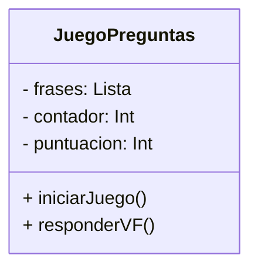
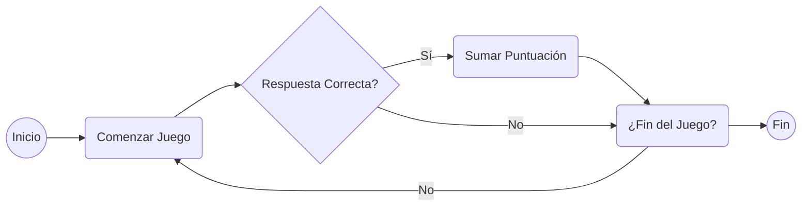

# Juego de Preguntas y Respuestas

## Características del Juego

El juego presenta una serie de preguntas con respuestas verdaderas o falsas. El objetivo es 
responder correctamente el mayor número posible de preguntas dentro de un límite de tiempo.

## Cómo Jugar

1. **Inicio del Juego:**

    - Al abrir la aplicación, presiona el botón "START" para iniciar el juego.
    - Se mostrará una pregunta con dos botones: "V" para Verdadero y "F" para Falso.
    - Comenzará una cuenta regresiva desde 20 segundos.

2. **Responder Preguntas:**

    - Lee la pregunta presentada.
    - Si crees que la respuesta es **verdadera**, presiona el botón "V". Si es **falsa**, 
      presiona el botón "F".
    - Cada respuesta correcta aumenta tu puntuación.

3. **Cuenta Regresiva:**

    - El tiempo para responder cada pregunta es limitado a 20 segundos.
    - La cuenta regresiva aparece en la interfaz para indicar el tiempo restante.

4. **Puntuación:**

    - La puntuación se muestra en la pantalla después de cada respuesta correcta.

5. **Finalización del Juego:**

    - El juego termina cuando se acaba el tiempo.
    - El botón "START" reiniciará el juego, permitiéndote jugar de nuevo.

## Descripción del Código

El código está escrito en Kotlin con Jetpack Compose. El juego contiene:

- **Funciones Composables:**
    - `FraseGame`: Crea la interfaz de usuario del juego.
    - `PreviewFraseGame`: Proporciona una vista previa de la interfaz.

- **Funciones de Control del Juego:**
    - `startCountdown`: Inicia la cuenta regresiva una vez se presiona el botón "START".
    - `cargarFrases`: Carga una lista de preguntas con sus respectivas respuestas.

- **Variables de Control:**
    - `fraseActualIndex`: Índice de la pregunta actual.
    - `countdownValue`: Contador del tiempo restante.
    - `gameStarted`: Estado del juego (iniciado o detenido).
    - `score`: Puntuación acumulada por respuestas correctas.

## Cómo Interactuar con el Juego

1. **Descargar e Instalar:**
    - Compila y ejecuta el código en un entorno de desarrollo Android compatible.

2. **Jugar:**
    - Abre la aplicación y presiona "START" para comenzar el juego.
    - Lee cada pregunta y selecciona "V" o "F" según tu respuesta.
    - Observa tu puntuación y trata de responder la mayor cantidad de preguntas dentro del límite 
      de tiempo.

3. **Repetir:**
    - Al finalizar el tiempo, presiona "START" para reiniciar y jugar otra vez.

## Diagrama de clases:

## Diagrama de flujo

