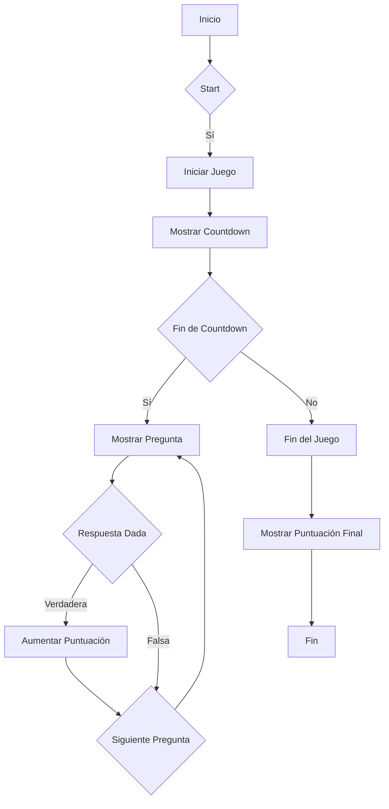
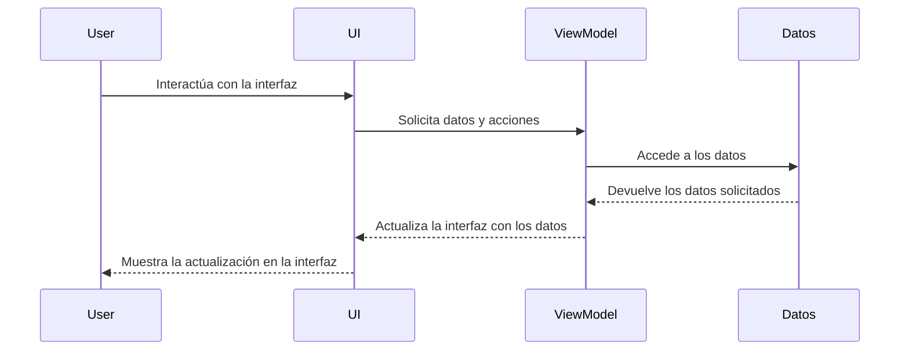
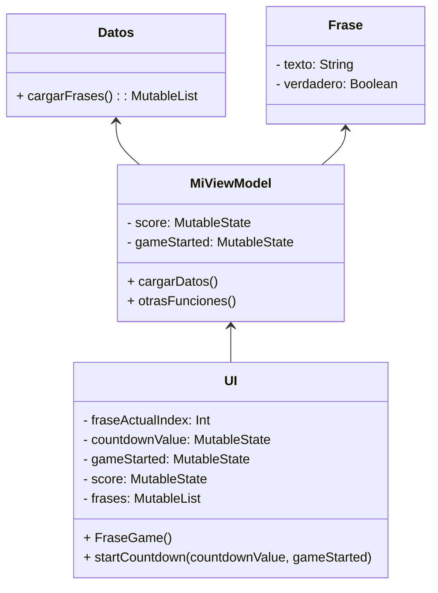

# Guía para migrar a MVVM con Jetpack Compose en Kotlin

Esta guía te ayudará a migrar tu aplicación a la arquitectura Model-View-ViewModel (MVVM) con Jetpack Compose en Kotlin para mejorar la organización del código y separar la lógica de la interfaz gráfica.

## Pasos a seguir:

### 1. Crear el archivo `MiViewModel.kt`

- **Objetivo**: Crear una clase ViewModel para manejar la lógica del juego y los datos.
- **Acciones**:
  - Crear una clase `MiViewModel` que extienda `ViewModel`.
  - Definir variables para el manejo de datos y lógica del juego.

### 2. Crear el archivo `Datos.kt`

- **Objetivo**: Definir la estructura de datos y la lógica para cargar las frases del juego.
- **Acciones**:
  - Crear una clase o archivo de datos (`Datos.kt`) para almacenar la lista de frases y la lógica para cargarlas.

### 3. Modificar el archivo `UI.kt`

- **Objetivo**: Utilizar el ViewModel para manejar la lógica del juego y los datos.
- **Acciones**:
  - Eliminar las variables y funciones relacionadas con la lógica del juego del archivo `UI.kt`.
  - Actualizar `FraseGame()` para utilizar las propiedades y funciones del ViewModel.

### 4. Integrar ViewModel en la composición

- **Objetivo**: Conectar el ViewModel con la interfaz gráfica.
- **Acciones**:
  - Crear una instancia del ViewModel en la composición.
  - Pasar el ViewModel a las funciones que manejan la interfaz.

### 5. Integrar ViewModel en la actividad principal

- **Objetivo**: Integrar la lógica del ViewModel en la actividad principal.
- **Acciones**:
  - Crear una instancia del ViewModel en la actividad.
  - Utilizar el ViewModel en la actividad para manejar la lógica y los datos.

### 6. Diagrama de flujo:

### 7. Diagrama de secuencia:

### 8. Diagrama de clases:

---

Esta guía proporciona una estructura general para migrar a la arquitectura MVVM con Jetpack Compose en Kotlin, ayudándote a organizar el código y separar la lógica del diseño de la interfaz.

